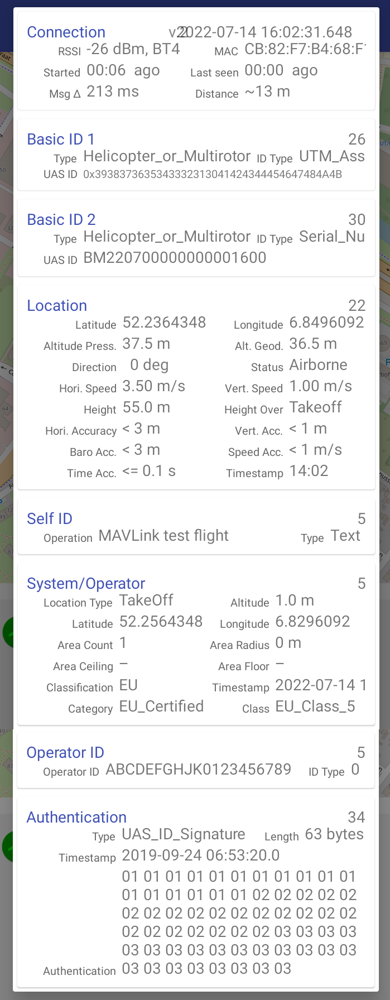

# RemoteID MAVLink test application

## What is it?
This repository contains source code of an application written in C to send OpenDrone ID MAVLink messages to a MAVLink capable transponder. It is meant only for test purposes.

## Installation
The code has been tested on an Intel 64-bit system running Ubuntu 20.04 LTS. 

Run make to compile the program.

```
make
```

## Configuration
The code has been tested with the [BlueMark DroneBeacon MAVLink transponder](https://dronescout.co/dronebeacon-mavlink-remote-id-transponder/), where an USB-to-UART adapter was connected to /dev/ttyUSB1 and baud rate 9600. If you want to change this, please UART_PORT and UART_BAUDRATE accordingly on line 40/41 of demo_tx.c.

## Usage

```
./bin/demo_tx
```

## Verification
The [Android Remote ID app](https://github.com/opendroneid/receiver-android) will show this screenshot after the application has sent the MAVLink message to the transponder.


